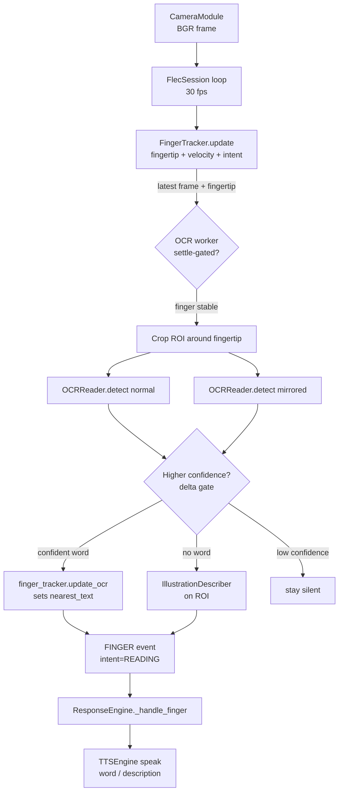

# Architecture: Reading Mode — End-to-End

**Feature:** reading-mode-end-to-end · **PRD:** ../../prds/PRD_reading-mode-end-to-end_2026-07-10.md

---

## Where this feature lives

Inside the existing queue-decoupled perception pipeline. No new top-level layer — this
wires the **Reading** path that is currently inert. The orchestration lives in
`FlecSession` (`src/flec/main.py`); the work is done by existing capability modules
plus one new **OCR worker**.

## Modules integrated / extended

| Module | Role in this feature | Change |
|--------|----------------------|--------|
| `camera/camera_module.py` | Supplies BGR frames | none |
| `perception/finger_tracker.py` | Fingertip position + velocity → `ReadingIntent`; `update_ocr(text_regions)` populates `nearest_text` | consume existing API; possibly tune intent thresholds (R7) |
| `reading/ocr_reader.py` (EasyOCR) | Recognize text in a crop → `(text, bbox, confidence)` | called by the OCR worker; add orientation-aware crop OCR |
| `reading/illustration_describer.py` (BLIP-2) | Describe a region when no word found | picture fallback (R4) |
| `engine/response_engine.py` | `_handle_finger` narrates `nearest_text`; single audio gatekeeper | unchanged contract; consumes richer FINGER events |
| `audio/tts.py` | Speaks the word; coalesces/expires narration | reused (word-change flush, R6) |

## New component — OCR worker (`reading/ocr_worker.py` or a `FlecSession` helper)

A **throttled background daemon thread** owned by `FlecSession`. Responsibilities:

1. Watch the latest frame + current fingertip state (position, velocity).
2. **Settle-gated trigger** (decision D1): run only when a fingertip is detected *and*
   stable (velocity below threshold for ~300–500 ms). Otherwise idle.
3. Crop the frame to a bounded ROI around the fingertip (bounds cost; standout #44).
4. OCR the crop **as-captured** and **horizontally mirrored**; pick the higher-confidence
   result by **confidence delta** (decision D2 — silence when delta/confidence is low).
5. Cache the winning orientation for the session (avoid re-probing every pass).
6. Map the fingertip x-coordinate into the chosen orientation (R8) and hand the recognized
   region(s) to `finger_tracker.update_ocr(text_regions=…)`.
7. If no confident word: request an illustration description of the ROI (BLIP-2) and route
   it as the pending illustration (R4); if BLIP-2 is unavailable, log a warning and stay silent.

The worker obeys the **queue-only contract**: it is orchestration (session-level) using the
*public* interfaces of `ocr_reader`, `illustration_describer`, and `finger_tracker` — it does
not import their internals, and the two capability modules still never import each other.
`ResponseEngine` remains the single audio/AR gatekeeper.

## Data flow

## Architectural decisions

- **D1 — Settle-gated OCR on a worker thread** (not inline, not continuous). Keeps the 30 fps
  loop responsive; the settle signal doubles as the READING-intent trigger.
- **D2 — Correctness over coverage.** Silence when the normal/mirror confidence delta is small
  or top confidence is below the gate — never speak a wrong word to a toddler.
- **D3 — Horizontal-mirror-only orientation, cached per session.** 90°/180° rotation is out of
  scope for v1 (integrated-webcam reality).
- **D4 — Fingertip crop ROI.** Read only the pointed word; bounds OCR cost on ARM64.
- **D5 — Zero persistence.** Crops, OCR text, and descriptions live only in memory.
- **D6 — Dev wear override.** In dev (no wear sensor) treat wear-state as `ON_HEAD` so Reading activates (R10).

## Conformance to CONSTITUTION §3

- **Queue-only / no cross-module imports:** worker uses public module APIs; capability modules stay decoupled. ✅
- **Single output gatekeeper:** `ResponseEngine` remains the only audio emitter. ✅
- **Models pre-warmed at boot:** EasyOCR (and BLIP-2 where available) warmed at session init. ✅
- **Wear-gates everything:** reading suspends when off-head; dev override is explicit. ✅
- **Zero persistence:** no frames/crops/audio/text written. ✅
- **Toddler-first:** failures degrade to silence; no error ever reaches the child. ✅
