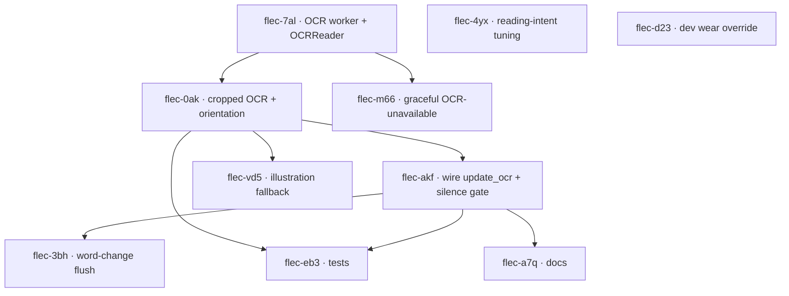

# Plan: Reading Mode — End-to-End

**Feature:** reading-mode-end-to-end
**Date:** 2026-07-10
**PRD:** [PRD_reading-mode-end-to-end_2026-07-10.md](../PRD_reading-mode-end-to-end_2026-07-10.md)
**Roadmap:** F-001 · **Tracker:** Beads (local Dolt DB, prefix `flec-`)

---

## Tasks

| Beads ID | Title | Labels | Depends On | AC |
|----------|-------|--------|-----------|-----|
| flec-7al | Add settle-gated OCR worker thread + instantiate OCRReader in FlecSession | backend, US-001 | — | 6 |
| flec-4yx | Tune reading-intent so a steady point reads (READING), fast sweep stays silent | backend, US-001 | — | 5 |
| flec-d23 | Dev wear-state override: treat integrated webcam as ON_HEAD | backend, US-001 | — | 8 |
| flec-0ak | Fingertip-cropped OCR + orientation resolution (normal vs mirrored, confidence-delta, cached) | backend, US-001 | flec-7al | 1 |
| flec-m66 | Graceful OCR-unavailable handling (structured warning, degrade to silent) | backend, US-005 | flec-7al | 7 |
| flec-akf | Wire OCR regions to FingerTracker.update_ocr + confidence silence-gate | backend, US-002 | flec-0ak | 2 |
| flec-vd5 | Illustration fallback when no confident word under fingertip | backend, US-003 | flec-0ak | 3 |
| flec-3bh | Word-change flush: drop pending reading narration when target word changes | backend, US-004 | flec-akf | 4 |
| flec-eb3 | Tests: OCR-orientation contract + Reading end-to-end integration | test, US-001 | flec-0ak, flec-akf | 1–9 |
| flec-a7q | Docs: RUNNING.md Reading section + docstrings + FLEC_OCR_* env vars | docs, US-001 | flec-akf | NFR |

---

## Dependency Graph

---

## Implementation Order (waves)

1. **Wave 1** (no deps, parallel): `flec-7al` (OCR worker scaffold + OCRReader), `flec-4yx` (reading-intent tuning), `flec-d23` (dev wear override).
2. **Wave 2** (needs Wave 1): `flec-0ak` (cropped OCR + orientation resolution ← flec-7al), `flec-m66` (graceful OCR-unavailable ← flec-7al).
3. **Wave 3** (needs flec-0ak): `flec-akf` (wire `update_ocr` + silence gate), `flec-vd5` (illustration fallback).
4. **Wave 4** (needs flec-akf): `flec-3bh` (word-change flush), `flec-eb3` (tests ← flec-0ak + flec-akf), `flec-a7q` (docs).

**Critical path:** flec-7al → flec-0ak → flec-akf → (flec-3bh | flec-eb3 | flec-a7q). TDD applies per task during Construction (failing test first).
